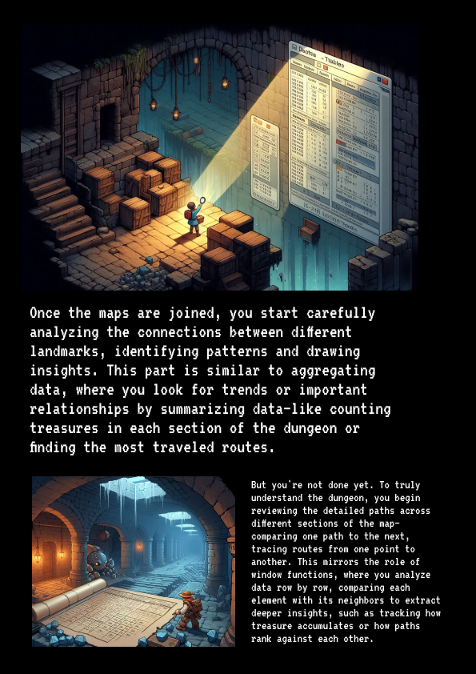

---

# Data Explorer Documentation





## Overview

The **Data Explorer** application is designed to facilitate data exploration and transformation through file uploads and various data manipulation operations. Users can upload two CSV files, merge them using different join types, and perform aggregations and window functions. The application also supports date handling for temporal analysis.

## Features

1. **File Upload**: Users can upload two CSV files for analysis.
2. **Data Preview**: Displays a preview of each uploaded dataset.
3. **Table Joins**: Supports INNER, LEFT, RIGHT, and FULL OUTER joins.
4. **Aggregate Results**: Provides summary statistics for each dataset.
5. **Window Functions**: Allows users to apply functions like ROW_NUMBER, RANK, LAG, and LEAD.
6. **Date Handling**: Enables date conversion and extracts temporal components.

## Requirements

- Python
- Streamlit
- Pandas

## Installation

To run this application, ensure you have the necessary libraries installed:

```bash
pip install streamlit pandas
```

## Usage

1. **Start the Application**: Run the following command in your terminal:

   ```bash
   streamlit run your_script.py
   ```

2. **Upload CSV Files**: Use the file uploader components to upload your two CSV datasets.

3. **View Dataset Previews**: After uploading, the app displays a preview of both datasets.

4. **Perform Joins**:
   - Select a join type from the dropdown.
   - Choose columns from each dataset to join on (if applicable).
   - The joined result is displayed below.

5. **Aggregate Results**: Summary statistics for each dataset are shown after performing the join.

6. **Apply Window Functions**:
   - Choose a window function and the column to apply it on.
   - Optionally, select a column for partitioning.
   - The results for both datasets are displayed accordingly.

7. **Date Analysis**:
   - Select date columns from each dataset for conversion to datetime objects.
   - The app will display the minimum and maximum dates and add year, month, day, and weekday columns.

## Code Structure

- **Page Configuration**: Sets the title, layout, and hides headers/footers.
- **Containers**: Organizes UI elements into sections using Streamlit containers.
- **File Uploads**: Implements file upload functionality and reads CSV files into Pandas DataFrames.
- **Data Merging**: Utilizes `pd.merge()` to join datasets based on user-selected columns.
- **Aggregations**: Uses `DataFrame.describe()` to compute summary statistics.
- **Window Functions**: Applies various window functions to analyze data row by row.
- **Date Handling**: Converts selected date columns and extracts relevant components.

## User Interface

- The app features a structured layout with columns and containers to guide users through the process.
- Images and descriptive texts enhance the user experience, making it easier to understand each step.

## Error Handling

- The application checks for valid file uploads and prompts users if any required actions are not completed.

## Conclusion

The Data Explorer app serves as a powerful tool for data exploration, offering essential functionalities for data manipulation and analysis. It is user-friendly and supports users in deriving insights from their datasets efficiently.

---
